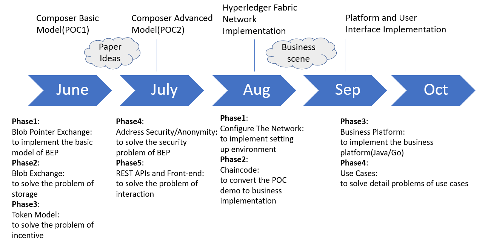

# Blob Exchange Platform

作者: 林泽培， 刘小粟， 柯杰瑞

## 摘要

在如今的互联网时代，交互信息好像是一件非常简单的事情，但是在保证匿名信息交互的同时又能保证可追溯、可监管就并不容易了，而区块链的出现恰恰为这件事提供了契机。Blob Exchange Platform(BEP)的目标在于构建一个匿名的信息交互系统，交互信息的双方可以隐藏自己的真实身份，在互相不知道对方是谁的情况下完成信息的交互，获取信息价值。BEP采用Hyperledger Fabric联盟链技术，任何的联盟参与方在区块链网络中的身份都只是一串地址，这个地址甚至可能是动态的、变化的，所以任何一方在区块链网络中的行为都是匿名的且参与方不可追溯的。

## 介绍

为了完成信息交互，我们知道有很多种方式，搜索，文章，问答等。而在这些之中问答是最为直接和精准的方式，提问者可以按需提问，回答者可以精确回答。现有的包括百度知道、知乎、Stack Overflow等都是采用这种方式来实现价值信息交互的。但是原有的系统都是通过中心化的方式来完成的，无法保证数据的隐私性，而且无法应用于某些特定场景，比如KYC、隐私数据确权等。BEP平台采用Hyperledger Fabric的联盟链区块链技术来完成原有的这些应用所无法实现的功能和场景。BEP保证了网络参与方的可信度，保证匿名性的同时又保证了数据的隐私性。

### 加密算法

#### 对称加密

采用单钥密码系统的加密方法，同一个密钥可以同时用作信息的加密和解密，这种加密方法称为对称加密，也称为单密钥加密。代理重加密技术对文件本身的加密就采用了对称加密的方法。

#### 非对称加密

在平台的区块链网络中，每个网络参与方有一套自己的公私钥对，链上存储着所有参与方公开的公钥，当参与方之一想要针对某个特定文件或隐私数据对某个特定参与方进行共享时，他需要先将自己的隐私数据用公钥加密存储于隐私存储平台，然后通过代理重加密的方式将隐私数据的确权与分发工作让BEP平台来自动化完成，隐私数据提供方只需确认对方有权限阅读即可。

#### 代理重加密

代理重加密是密文间的一种密钥转换机制，在代理重加密中，一个半可信代理人通过代理授权人产生的转换密钥Rk把用授权人Alice的公钥Pa加密的密文转化为用被授权人(Delegatee)Bob的公钥Pb加密的密文，在这个过程中，代理人得不到数据的明文信息，从而降低了数据泄露风险。

### 区块链

#### 历史记录可追溯

我们采用Hyperledger Fabric的技术[1]，主要就是为了保证账本的不可更改性。所有的历史记录都可以通过区块链网络来追溯，利用区块链技术来保证记录的真实性与可靠性，不会发生第三方恶意更改记录的情况。

#### 隐私性

BEP区块链网络不记录任何一个人的个人信息，所有的区块链网络参与方的个人信息都是由他们自己来保存，参与方在区块链网络上的身份都是地址的形式，这也是区块链本身的一大特性，很难以通过地址追溯到个人的真实身份[2]。

#### 智能合约

BEP平台采用Hyperledger Fabric技术，Fabric自带chaincode(智能合约)，平台可以通过智能合约让所有的流程自动化，包括提问，回答，激励策略，数据确权等，与此同时也保证了平台的数据流转透明化，操作行为记录可追溯。

### 隐私存储

关于存储问题，由于平台各个参与方的存储系统都是不一样的，如果使用纯粹的数据指针来作为交互对象会存在以下几个问题:

- 由于存储源的多样性，存储系统的差异性容易产生不可预知的错误而且无法找到原因
- 由于存储系统非平台自身可控，造成关于文件访问记录的不可追溯行
- 由于传递的是数据指针，容易暴露数据拥有者身份，丧失平台匿名性特征

为了解决以上的存储问题，所以我们需要采用既能保证隐私又能保证可靠性的存储方案，所以我们会搭建一套隐私存储平台，设立一套标准化的接口，再通过代理重加密的方式，参与方如果将来有数据需要确权和分发，那么让参与方将现有数据通过代理重加密的方式上传到我们的隐私存储平台，平台和其他参与方都无法看到数据本身，只有数据拥有方赋权给其他参与方，其他参与方才能够看到数据本身。通过搭建隐私存储平台和代理重加密技术，平台就可以追溯所有操作记录，而且保证了错误的可预知性(系统崩溃、数据丢失等)，同时也更加确保了匿名性。

## 系统架构

### 流程图

流程图如上图所示，首先已有的数据方将已有数据通过我们的统一标准接口加密上传到我们的隐私存储系统，然后此后所有跟隐私文件相关的读取都与隐私存储系统进行交互。我们假设平台中有两个用户Alice和Bob，首先Alice和Bob会将他们已有的数据通过我们定义的标准化接口上传到我们的隐私存储平台，然后我们将上传数据的生成的胶囊索引存储于账本。此后，Alice想要获取某些数据，她向平台发起了`PushRequest`请求，然后BEP平台生成一条请求，其他所有用户均可看到请求内容。Bob发现某个请求(Alice的请求，但他并不知晓是谁)的数据他刚好有，Bob针对这个`Request`发起，Bob同意Alice阅读他的某一部分数据，Bob向BEP平台发起`PushResponse`请求，BEP平台帮助分发解密胶囊的钥匙，最后Alice可以查阅数据，然后Alice确认数据是否符合自己的需求，一旦数据符合需求，Alice将会采用这个`Response`，发起了`AcceptResponse`请求，最后平台将给予被采纳者一定的积分激励。整个流程中的所有操作记录都将记录在账本之上，可以做后续历史记录追溯。

### 系统架构图

自下而上分别是:

- **Hyperledger Fabric区块链网络层**
- **隐私存储层**
- **SDK封装层，数据中转层**
- **用户交互层**

### 技术选型

- **区块链网络: Hyperledger Fabric**
- **SDK: Fabric-Go-SDK**
- **后端: Go**
- **前端: React + Redux**
- **UI: SemanticUI + MATERIALUI**

## 隐私存储与代理重加密

### 开放的数据场景

个人终端已经很难肩负起新时代大量数据的存储，数据的云端存储成为主流，而对应的隐私问题也逐渐凸显。个人隐私数据存储在云端会带来许多不可控的风险，iCloud、百度网盘都发生过较大规模的数据泄露事件。值得一提的是，这些泄露并非因为云端被黑客攻破造成的，而是用户密码被黑客撞库或破解，或产品逻辑混乱导致用户错误操作造成的。请注意，这还没有考虑到云服务提供商的道德风险，百度公司是知道每个用户在网盘中的数据内容的，用户完全没有隐私。对隐私比较在意的用户会使用WinZip等软件对文件进行加密后，再传送到网盘上，但这样当用户需要使用时，只能将文件完整下载后，在本地解密才能使用。

数据场景日趋多样，用户对云端存储的数据有了更多处理的需求。例如需要将文件分发给其它用户（可能收取费用，典型的应用是文档分享/音乐分享）。如果文件以加密形式存储在云端，意味着用户在分享文件时，还需要私下将加密密钥或口令传输给数据的接收方。用户并不具备随时响应的能力，和数据接收方也不一定有通信的渠道。所以问题来了，如何在保证文件内容保密的情况下，又能及时处理并分发给接收者，且接收者可以解出原始的数据呢？

### 代理重加密

在云计算中，云计算服务提供商作为代理人，用户A不能完全相信云计算服务提供商，因此需要将自己的数据在本地用自己的公钥加密后在云中存储，这样代理人无法得到数据的明文信息。当他要和用户B共享文件时，A根据自己的信息（如私钥）及用户B的公钥Pb计算一个转换密钥Rk，由代理人使用Rk将针对A的密文转换为针对B的密文。这样，B可以从云中下载该密文，只用自己的私钥即可解密[3]。

具体流程[4]如图所示:

Alice是发送人，Bob是接收人，Proxy是代理机构。(ska, pka)、(skb, pkb)分别是Alice和Bob的私钥、公钥，rka→b是代理重加密密钥，cA是只有Alice可以解开的密文，cB是只有Bob可以解开的密文。目前，代理重加密已经有了比较成熟的算法，NuCypher选择了ECIES，并考虑引入AFGH和NTRU方案，解决信任拆分和抗量子的问题。

## Roadmap

## 参考文献

[1] Cachin C. Architecture of the hyperledger blockchain fabric[C]//Workshop on distributed cryptocurrencies and consensus ledgers. 2016, 310: 4.

[2] Zheng Z, Xie S, Dai H N, et al. Blockchain challenges and opportunities: A survey[J]. International Journal of Web and Grid Services, 2018, 14(4): 352-375.

[3] Egorov M, Nuñez D, Wilkison M L. NuCypher: A proxy re-encryption network to empower privacy in decentralized systems[J].